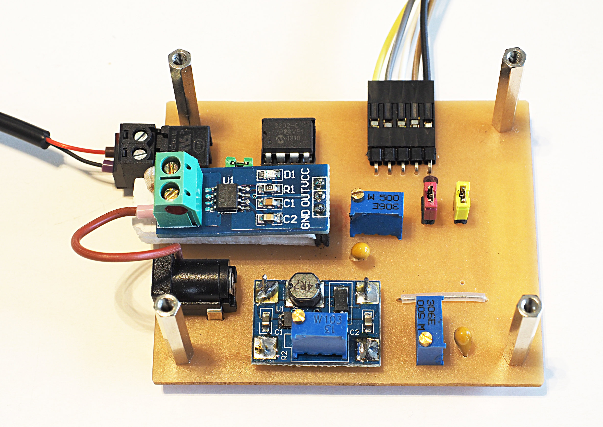
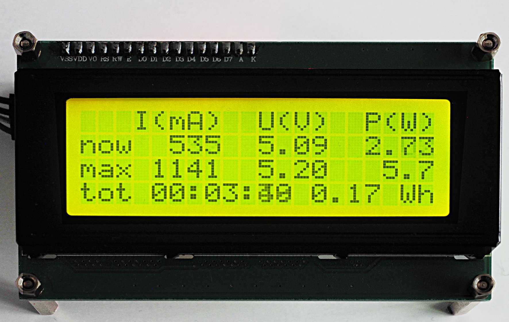
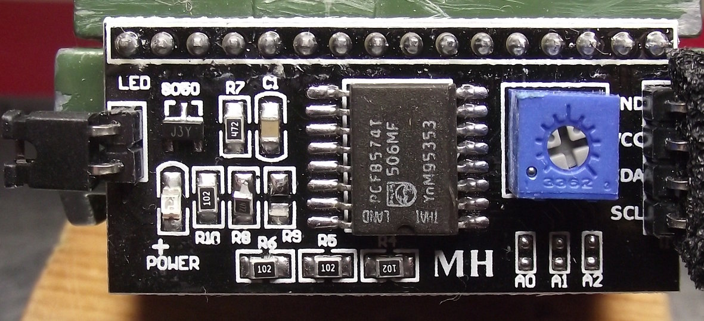
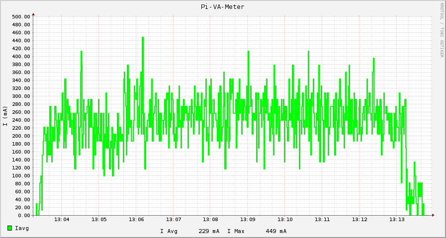
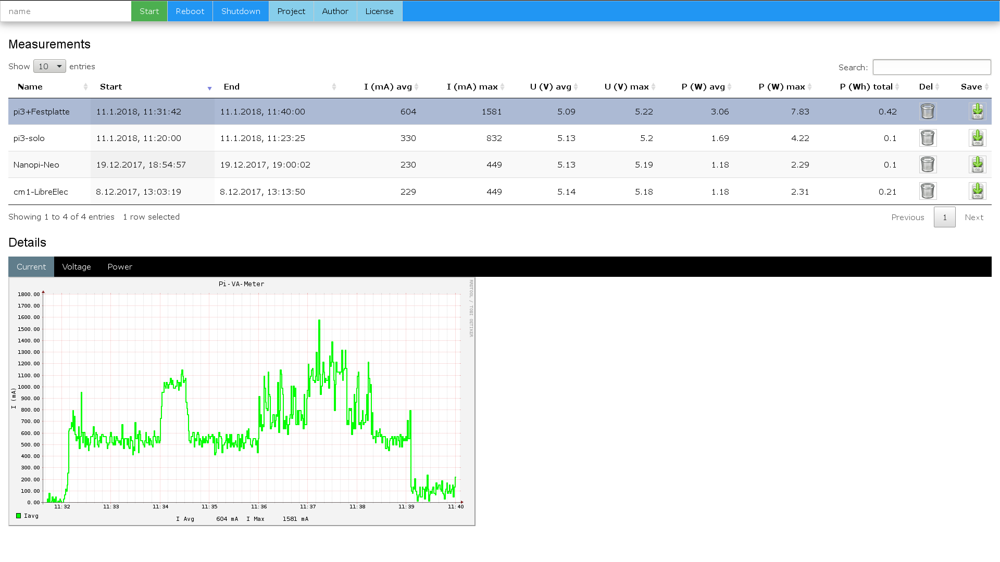

pi-vameter
==========

This is a little circuit to measure current and voltage of a Raspberry Pi
or other small computers using 5V input. In contrast to ready to use
USB-dongles which you just plug in between the power source and the consumer,
this circuit feeds it's measurement into the SPI-interface  of a (second) Pi,
therefore you can record current, voltage and power over time.

Status/News
===========

Jan 2018 Initial version
------------------------

The software is feature complete (but maybe not bug-free).

Hardware
========

The Module
----------

The module  mainly uses two components

  - an ADC converter with at least two channels (e.g. MCP3002)
  - a Hall sensor

Ssee  the [circuit](doc/circuit-module.gif "circuit") for details,
also available are a top and bottom view of the circuit:

  - [top view](doc/module-topview.gif "top view")
  - [bottom view](doc/module-bottomview.gif "bottom view")

The ADC will read the voltage on it's first channel directly. In the
Hall sensor the current induces a magnetic field, which in turn induces
some voltage which we feed into the ADC's second channel. We therefore
measure the current indirectly.

The output-pins of the ADC are connected to the
[SPI interface](doc/spi-pi-connection.gif "SPI connection") of the pi.

The Display
-----------

The measurement software supports a LCD display 
with 4 rows and 20 columns attached to the I2C-interface of the Pi running the
measurements.

The display is not strictly necessary, since it only displays live data.
The recording of the data is independent of the display. When the measurement
is started from a terminal (e.g. using ssh), the live data is also shown
in the terminal.

To attach the LCD to the Pi, you at least need a parallel-to-serial adapter
 for the LCD. Since most of the
LCDs are targeted towards the Arduino-platform, they need 5V. So in
addition you also need a level-converter to convert the 3.3V of the Pi to
the 5V of the display.

An alternative to the level converter is to manipulate the i2c-converter
and to remove two resistors (labeled R8 and R9 in the above image). These
resistors attach SDA and SCL to 5V. In the image you can see the R9
already removed and the R8 is partially off.

If unsure, you should read the tutorials on the net on how to use and
attach an LCD to a Pi.

The button and LED
------------------

Optionally, you can attach a button and/or a LED to GPIOs. The installation
defaults are GPIO23 for the button and GPIO18 for the LED. Using the button,
you can start and stop recording data. During recording the LED will blink.

Please read the tutorials on the internet on how to attach a button and a
LED to a Raspberry Pi.

Software
========

This project contains a number of software-components for the measurement
of the ADC values:

  - **vameter.py**: This script reads the values of the ADC using the SPI
    interface and records the data in a round-robin-database (RRD-database)
  - **vameterctrl**: A wrapper script for starting data-collection using
    a button attached to a GPIO-pin
  - **vameter-web.py**: A small webserver for starting and stopping the data
    collection and for the presentation of the results.

Installation
------------

The installation assumes that you have a freshly installed
Raspbian-Stretch-Lite installation (Jessie won't work since the
version of rrdtools/python-rrdtools is too old on Jessie).

Use the following commands to install the software:

    sudo apt-get update
    sudo apt-get -y install git
    git clone https://github.com/bablokb/pi-vameter.git
    cd pi-vameter.git
    sudo tools/install
    cd ..

    git clone https://github.com/bablokb/gpio-poll-service.git
    cd gpio-poll-service
    sudo tools/install

The second set of installation commands is only necessary if you wish to
use buttons attached to GPIOs to control the measurement. In this case
you should check the file `/etc/gpio-poll.conf`. This file contains the
configuration of the pin for the button.

The install command will copy all scripts, install additional software
(mainly the required python-modules), modify `/boot/config.txt`, add a
system-user for the web-service and add a number of system-services. Due
to the changes to `/boot/config.txt` you have to reboot your system to
activate the changes.

Besides the configuration of the GPIO for the start/stop-button you also
have to check the script `/usr/local/bin/vameter.py`. Sadly, every ADC-converter
needs it's special read commands and you have to configure the data
for the ADC you are using. The script already contains some values for
widely used ADCs (check variables `ADC` and `ADC_VALUES` at the beginning
of the script). If your ADC is already supported you just have to change
the variable `ADC`. Otherwise, you have to add the values of your ADC to
`ADC_VALUES` first (and submit a patch).

The database
------------

Data is stored in a round-robin-database using the **rrdtools**. The size
of the database does not grow with measurement time, since only a limited
amount of data is saved while older data is saved only in aggregated form.
The `vameter.py` script saves one hour of data with seconds-resolution,
24 hours of data with minute-resolution and so on.

Usage
=====

Script-based
------------

The command

    vameter.py -h

will show a list of all available options. A typical use case is to
start the data collection and create a set of graphs afterwards:

    vameter.py -g IUP -r mydata.rrd

This will start recording measurements and save the results in file `mydata.rrd`.
To stop the data-collection, hit CTRL-C. Since we passed the option `-g IUP`,
the script will generate after termination three graphics for current, voltage
and power .

You can use

    vameter.py -p mydata.rrd

to print existing data and

    vameter.py -S mydata.rrd

to print a summary of the results.

Button-based
------------

If you have attached a button to a GPIO and configured `/etc/gpio-poll.conf`
accordingly, you can start and stop data collection with the button (no need
to ssh to the system anymore).

Data is automatically saved in the directory `/var/lib/vameter/data`. The
database name is auto-generated from the start date and time.

Web-based
---------

The project also installs small webserver using port 8026. If you point
your browser to the address

    http://ip-of-your-pi:8026/

you will see the webinterface 
of the system. The buttons on the top will let you start (and stop) the data
collection or will let you shutdown the system.

The middle part shows all available measurements (from directory
`/var/lib/vameter/data`) with some summary data. The bottom part
will show a list of tabs to select a graphical representation of the
current, voltage and power consumption during the measurement.
